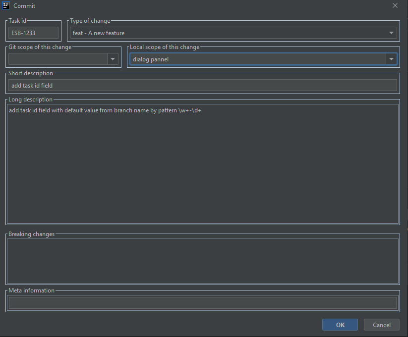

# Git commit template Plugin for IntelliJ

**Thanks [MobileTribe](https://github.com/MobileTribe/commit-template-idea-plugin) for the idea and example.**

This plugin allows to create a commit message with the following template:

```
    <type>(<scope>): <subject>
    <BLANK LINE>
    <body>
    <BLANK LINE>
    <footer>
```

## Installation

Install directly from the IDE plugin manager:

1. Download [latest release](https://github.com/ezhov-da/git-commit-template/releases/latest)

1. Install from disk
> File > Settings > Plugins > Settings > Install Plugin From Disk > Choose downloaded .zip file

## Usage

By default GIT Store location in: ${user.home}/.git-commit-template/git-store.xml

The priority scope is "Git Scope", if empty, "Local Scope" is used.




